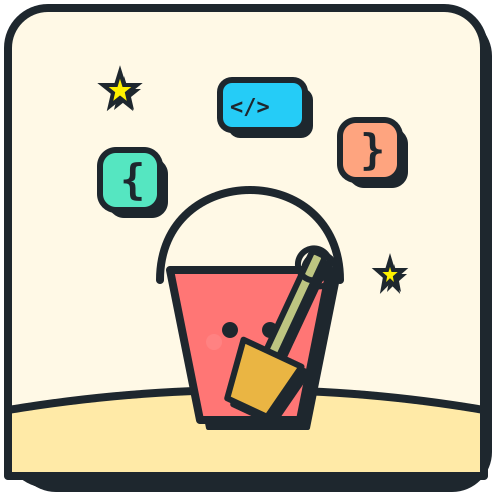

<h1 align="center">The Sandbox</h1>

<p align="center">
  
</p>

<div align="center">

Startups turn internal bugs and backlog items into **public coding challenges**. Students solve them to prove skill: without a traditional job application and without seeing which company wrote the problem.

**Zero-trust** here means: sensitive data (log lines, emails, internal product names) is cleaned up **on the startup's machine first**. Only a safe, abstract summary crosses into the rest of the platform.

> *"We aren't a job board; we are a proof-of-work protocol."*

</div>

---

## Who uses this?

| Who | What they do | Where in the app |
|---|---|---|
| **Startup** (CTO / founder) | Turn an internal problem into a publishable challenge, set a bounty, review who submitted | `/startup` · `/startup/upload` · `/startup/matches/{id}` |
| **Student** | Browse challenges, read the brief, build a solution, submit | `/student` · `/student/challenges/{id}` · `/student/leaderboard` |
| **Enterprise recruiter** *(demo UI)* | Browse platform-wide top talent | `/enterprise/radar` |

Three things to know up front:

- Students **never** see the real company name on a challenge (see [Blind audition](#3-blind-audition)).
- Startups **only** see submitters for **their own** challenge, not other companies' candidates.
- "How good are they in general?" and "How well did they solve *my* problem?" are **two different scores** (see [Grading & rankings](#5-grading--rankings)).
- **No app database in this hackathon build** — student drafts, submissions, and test-run jobs persist on disk under `data/`; the CTO backlog lives in memory and resets when you restart the backend. A production deployment would use a persistent database (Postgres or similar) for backlog, users, and tenancy.

---

## The journey (at a glance)

Plain-language view of the full loop. Technical terms are defined in the sections below.

```
  ┌────────────────────── STARTUP ──────────────────────┐
  │  1. Paste logs, upload a file, or write a problem   │
  │     brief (cleaned locally)                         │
  │  2. See how urgent & risky the issue is             │
  │  3. Tweak the public brief, set bounty, publish     │
  │  4. Review who submitted — ranked for this challenge│
  └──────────────────────────┬──────────────────────────┘
                             │  public challenge goes live
                             │  (no company logo / internal names)
                             ▼
  ┌────────────────────── STUDENT ──────────────────────┐
  │  1. Browse challenges in the Innovation Hub         │
  │  2. Read brief + anonymous company profile          │
  │  3. Build solution (code editor or prototype)       │
  │  4. Submit → receive feedback scores                │
  └──────────────────────────┬──────────────────────────┘
                             ▼
  ┌──────────────────── OUTCOMES ───────────────────────┐
  │  Student: points on global leaderboard (demo seed)  │
  │  Startup: ranked list for their challenge (live)    │
  │  Enterprise: top-tier view across platform (demo)   │
  └─────────────────────────────────────────────────────┘
```

**Privacy rule:** Raw corporate text never leaves the local sanitization step. External AI (if enabled) sees field names and counts, not full log lines, emails, or internal codenames.

---

## How the pieces fit together

The sections below map to the journey above. Skim the headings first; drill in where you need detail.

### 1. Ingest & triage (startup)

**Goal:** Get a messy internal signal (Slack thread, log export, ticket, or founder-written brief) into a ranked backlog item without leaking PII.

Three equivalent ingest paths (all run **sanitize → score** locally before triage):

| Path | Where | API |
|---|---|---|
| **Upload UI** | `/startup/upload` → loading page | `POST /proxy/sanitize` then `POST /triage/score` |
| **Quick intake** | Sidebar on `/startup` | `POST /triage/intake` (wraps sanitize + score) |
| **API / scripts** | curl or `./scripts/factory_*.sh` | same as above |

1. **Privacy proxy** — runs locally. Strips emails, tokens, names, etc. Output is *structural metadata* (column names, event counts, row scale), not the original text.
2. **AI triage** — scores each item on three axes (0–100):
   - **Severity** — how badly it hurts the system
   - **Friction** — how often users hit it
   - **Sensitivity** — how risky it is to publish the *shape* of this problem publicly
3. **Sensitivity shield** — Red / Yellow / Green tag derived from the sensitivity score. Guides how aggressively to mask before publish.

The hackathon dashboard ships with **pre-seeded demo items** (`demo-003` … `demo-007`) so you can skip ingest UI. Adding new items:

```bash
# Option A — founder brief (one call)
curl -s -X POST http://localhost:8000/api/v1/triage/intake \
  -H "Content-Type: application/json" \
  -d '{"problem_statement":"Our webhook retries duplicate charges on 502...","source_label":"Founder brief","format":"text"}'

# Option B — logs (two steps, same as /startup/upload)
curl -s -X POST http://localhost:8000/api/v1/proxy/sanitize \
  -H "Content-Type: application/json" \
  -d '{"content": "2024-03-12 ERROR Login failed for user@example.com ...", "format": "log"}' \
  | tee /tmp/meta.json

curl -s -X POST http://localhost:8000/api/v1/triage/score \
  -H "Content-Type: application/json" \
  -d "$(jq '{metadata: .metadata, source_label: "Slack #bugs"}' /tmp/meta.json)"
```

**End-to-end scripts** (non-demo **technical** item → Preview → Publish):

```bash
./scripts/factory_pipeline.sh              # log sanitize → score → relax → publish (ARCHETYPE=auto)
./scripts/factory_intake.sh                # founder brief via /triage/intake

# Per-archetype samples (10 archetypes — log or intake mode)
./scripts/samples/run_archetype.sh idempotency_engine
./scripts/samples/run_archetype.sh webhook_handler intake
PREVIEW_ONLY=1 ./scripts/samples/run_all_previews.sh   # preview only, no publish
```

See [`scripts/samples/DOCS.md`](scripts/samples/DOCS.md) for the full archetype catalog.

**Note:** Product-track items (e.g. merchant-discovery briefs, `demo-004`) skip the dynamic factory — Preview returns a product Micro-PRD and HTML starter at publish, not a Python `challenge_package`.

See [`samples/demo_solutions/DOCS.md`](samples/demo_solutions/DOCS.md) for publish → submit demos on `demo-*` items.

### 2. De-risk & publish (startup)

**Goal:** Founder controls what students actually see before anything goes live.

On `/startup`, the sidebar groups backlog items into **In triage**, **Live challenges**, and **Closed** (collapsible sections). For each item in triage:

1. **Review scores** — Severity / Friction / Sensitivity and the Red / Yellow / Green shield
2. **Preview Changes** — for **non-demo technical** items, runs the [Challenge Factory](backend/challenge_factory/DOCS.md): single-pass **TechnicalChallengeSpec** → starter files + `docs/SPEC.md` + validation. **Product track** items get a product Micro-PRD only (frontend starter at publish).
3. **Relaxation controls** — optional transforms that make the public challenge safer:
   - Rename internal column names to generic ones
   - Inject noise into scale hints
   - **Domain obfuscation** — reframe an industry-specific problem as a neutral scenario (e.g. food-delivery checkout → equipment locker rental) so students can't guess the sponsor
4. **Release preview** — edit the public title, success criteria, **challenge blueprint** (archetype, stack hints), company profile, and evaluation focus before publish
5. **Lock reward** — required checklist step before publish (payment is stubbed in the demo — see [disclaimer](#whats-implemented-vs-whats-demo-theater))
6. **Approve & publish** — scope guard blocks oversized challenges (see `demo-007`); non-demo items require a valid Preview package. Published items move to **Live challenges**.
7. **Close submissions** *(optional)* — removes the challenge from the student hub and stops new submissions; archived under **Closed**. Match Radar stays available for reviewing past submissions.

### 3. Blind audition

**Goal:** Students trust the challenge is real without learning *which* company posted it.

| What the startup sees (internal) | What the student sees (public) |
|---|---|
| Real source label, internal codenames | Anonymous **Company Tech Profile** (stage, team size, stack) |
| Before/after domain masking preview | Sanitized **Micro-PRD** (markdown brief — scenario, typed examples, success criteria) |
| Industry-specific field names | Renamed / abstract column names |

Students can read `/student/trust` for the trust narrative (marketing copy in the demo; no live KYC backend).

### 4. Solve & submit (student)

**Goal:** Student builds and submits in-browser.

| Track | What you do | What you submit |
|---|---|---|
| **Technical** | Multi-file **Monaco** editor (same engine as VS Code), run public tests, autosave | Python starter + `docs/SPEC.md` (+ synthetic SQLite for `data_core` archetype) |
| **Product Feature** | Prototype editor | HTML/CSS/JS + **DESIGN.md** |

After submit, the student sees a **scorecard** with two sections (see next).

### 5. Grading & rankings

**Goal:** Separate "objective platform quality" from "does this person fit *my* challenge?"

Every submission gets a **dual-layer scorecard**:

| Layer | Plain English | Feeds |
|---|---|---|
| **Platform Signal** | Did the solution pass automated checks? (secret tests in Docker, security scan, deliverable structure) | **Execution Points** — global student motivation score |
| **Sponsor Fit** | How well does this submission match *this challenge's* success criteria? (LLM or heuristic) | **Match Radar** — startup's ranked list at `/startup/matches/{id}` |

A student can score high globally but not top a specific startup's list — and vice versa. That's intentional.

### 6. Three places rankings appear

See [What's Implemented vs Demo Theater](#whats-implemented-vs-whats-demo-theater) for which of these use live data today.

| Who looks | Page | Sorted by |
|---|---|---|
| Student | `/student/leaderboard` | Execution Points *(demo seed)* |
| Startup | `/startup/matches/{id}` | Sponsor Fit *(live after submissions)* |
| Enterprise | `/enterprise/radar` | Platform Signal *(demo seed)* |

---

## Defensive posture

Which security rules are enforced vs narrated for the demo: [What's Implemented vs Demo Theater](#whats-implemented-vs-whats-demo-theater).

Demo-only internal names students never see: **StealthCo** (`demo-005`), **NovaPay** (`demo-003`), **Platform Pool** (`demo-006`).

---

## Tech Stack

| Layer | Technology |
|---|---|
| Backend | Python 3.11+ · FastAPI · Pydantic v2 |
| Privacy Proxy | Regex PII masking · spaCy `en_core_web_sm` (local NER, offline) |
| AI / LLM | OpenAI (`gpt-4o-mini`) **default for dev/demo** · optional local vLLM (Qwen) for privacy-first sensitive tier · heuristic fallback when no LLM |
| Assessor | Dual-layer: Docker secret tests (platform) + LLM sponsor fit |
| Frontend | Next.js 14 · TypeScript · Tailwind CSS · Monaco editor |
| Persistence (MVP) | Local `data/` dir (drafts, submissions, jobs) · in-memory backlog · SQLite files are **challenge datasets**, not the app DB |
| Testing | pytest · 126 tests |
| Code Runner | Docker assessor (`the-sandbox-runner`) for secret tests; in-process for student **Run** |

---

## Project Structure

```
the_sandbox/
├── backend/
│   ├── privacy_proxy/          # Local PII scrubbing, NER, structural extraction
│   ├── ai_pm/                  # Triage, relaxation, blind audition, Micro-PRD, publish draft
│   ├── prompts/                # LLM system prompts (ai_pm + assessor)
│   ├── assessor/               # Dual-layer platform signal + sponsor fit
│   ├── sandbox/                # Datasets, submissions, leaderboard, match radar
│   ├── api/                    # HTTP routes
│   └── tests/
├── frontend/
│   ├── app/startup/            # Triage dashboard + sponsor Match Radar
│   ├── app/student/            # Innovation Hub, workspace, leaderboard, trust
│   └── app/enterprise/radar/   # Enterprise subscription view (demo)
├── docker/sandbox-runner/      # Assessor container image
├── samples/demo_solutions/     # Reference submissions for demo-003/004/005
├── docs/                       # ARCHITECTURE, PRODUCT, api-patterns
├── .env.example                # Environment template (copy to .env)
├── feature_list.json           # Feature state + verification evidence
└── init.sh
```

Module docs: [`backend/privacy_proxy/DOCS.md`](backend/privacy_proxy/DOCS.md) · [`backend/ai_pm/DOCS.md`](backend/ai_pm/DOCS.md) · [`backend/prompts/DOCS.md`](backend/prompts/DOCS.md) · [`backend/assessor/DOCS.md`](backend/assessor/DOCS.md) · [`backend/sandbox/DOCS.md`](backend/sandbox/DOCS.md) · [`backend/api/DOCS.md`](backend/api/DOCS.md) · [`frontend/DOCS.md`](frontend/DOCS.md)

Topic docs: [`docs/ARCHITECTURE.md`](docs/ARCHITECTURE.md) · [`docs/PRODUCT.md`](docs/PRODUCT.md) · [`docs/api-patterns.md`](docs/api-patterns.md)

---

## Quickstart

### Prerequisites

- Python 3.11+
- Node.js 20+
- Docker *(optional — required for full platform secret-test grading on submit)*
- OpenAI API key *(recommended for dev — triage, Micro-PRD, sponsor fit; see note below)*
- vLLM + Qwen *(optional — privacy-first on-prem sensitive tier; keeps column names local)*

### Backend

```bash
python -m venv .venv && source .venv/bin/activate
pip install -r backend/requirements.txt

# Optional: local NER model (~12 MB)
pip install "spacy==3.7.0"
pip install "https://github.com/explosion/spacy-models/releases/download/en_core_web_sm-3.7.1/en_core_web_sm-3.7.1-py3-none-any.whl"

cp .env.example .env
# Edit .env — set OPENAI_API_KEY for dev (default path); optionally enable LLM_BASE_URL for vLLM
set -a && source .env && set +a

python -m uvicorn backend.main:app --reload --port 8000
```

API: **http://localhost:8000** · OpenAPI: **http://localhost:8000/docs**

### Frontend

```bash
cd frontend && npm install && npm run dev
```

App: **http://localhost:3000** → redirects to **/startup**

### Tests

```bash
python -m pytest backend/tests/ -v    # expect 126 passed
```

### Assessor Docker image (optional — auto-built when Docker is running)

If Docker is up, the backend **builds `the-sandbox-runner:latest` automatically** on startup (background thread) and again before the first graded submit if needed. `./init.sh` also builds the image when the daemon is available.

Manual build is only needed if auto-build fails:

```bash
docker build -t the-sandbox-runner docker/sandbox-runner
```

Without Docker, platform technical grading degrades to static security scan only — student code is **never** executed on the host.

Or run everything via `./init.sh`.

### Sample solutions (testing)

Ready-to-submit reference projects for `demo-003`, `demo-004`, and `demo-005` live in [`samples/demo_solutions/`](samples/demo_solutions/DOCS.md). One-liner after the backend is running:

```bash
./samples/demo_solutions/test_sample.sh demo-003
```

---

## Environment Variables

Copy [`.env.example`](.env.example) to `.env` and load it before starting the backend:

```bash
cp .env.example .env
set -a && source .env && set +a
```

The backend does not auto-load `.env` — export vars manually or use the `source` pattern above. Never commit `.env` (listed in `.gitignore`).

> **LLM default for this repo:** OpenAI is the default dev setup (`OPENAI_API_KEY` only). All demo backlog items, synthetic datasets, and sample logs are **fabricated** — LLM calls receive anonymized structural metadata (field names, severity hints), not real customer data, so cloud LLM is acceptable for hackathon development. For production with real startup signals, run **vLLM locally** (`LLM_BASE_URL`) and set `LLM_ALLOW_CLOUD_SENSITIVE=0` so sensitive tier never leaves your network.

### OpenAI cloud (default for dev / demo)

| Variable | Default | Description |
|---|---|---|
| `OPENAI_API_KEY` | *(unset)* | **Default LLM backend** for triage, Micro-PRD, domain obfuscation, sponsor fit. Heuristic/template fallbacks if absent. |
| `OPENAI_MODEL` | `gpt-4o-mini` | Model id for OpenAI requests. |
| `LLM_ALLOW_CLOUD_SENSITIVE` | on | Set `0` to block OpenAI for **sensitive** tier (local vLLM only). Default: allowed — fine for fabricated demo data. |
| `LLM_DOMAIN_OBFUSCATE` | on | Set `0` to disable LLM domain masking for novel industries. |

### Local vLLM + Qwen (optional — privacy-first)

| Variable | Default | Description |
|---|---|---|
| `LLM_BASE_URL` | *(unset)* | OpenAI-compatible local endpoint, e.g. `http://localhost:8000/v1` when running vLLM. When set, sensitive tier tries local **first**, then OpenAI unless `LLM_ALLOW_CLOUD_SENSITIVE=0`. |
| `LLM_MODEL` | `Qwen/Qwen2.5-7B-Instruct` | Model id on the local server. |
| `LLM_API_KEY` | `local` | API key sent to the local server (vLLM often accepts any value). |

Start vLLM in a separate terminal (not a pip dependency of this repo):

```bash
vllm serve Qwen/Qwen2.5-7B-Instruct --port 8000
```

### Minimal setups

| Goal | Config |
|---|---|
| Offline demo (no LLM) | Leave all vars unset — heuristics + templates |
| **Dev / hackathon (default)** | `OPENAI_API_KEY` only |
| Privacy-first production | `LLM_BASE_URL` + `LLM_ALLOW_CLOUD_SENSITIVE=0` |
| Local + cloud fallback | `LLM_BASE_URL` + `OPENAI_API_KEY` (local first, OpenAI if local down) |

---

## What's Implemented vs What's Demo Theater

Read this before the judge script: it labels what is real pipeline code vs hackathon shortcuts.

The README uses three labels:

| Label | Meaning |
|---|---|
| **Implemented** | Code runs for any backlog item you create — not limited to `demo-*` seeds |
| **Demo shortcut** | Real UI/API exists, but this hackathon uses pre-written samples or hardcoded IDs to make judging easy |
| **Not built** | Shown in copy or UI only; no backend |

### Implemented (works beyond seeded items)

These pipelines are **general-purpose**. You can `POST /triage/score` a new item from sanitized metadata and run the same flow as `demo-003`:

- **Privacy proxy** — any raw log text via `POST /proxy/sanitize`
- **Triage scoring** — Severity / Friction / Sensitivity on any `SanitizedMetadata`
- **Relaxation controls** — column rename, noise, abstract logic on any item's metadata
- **Domain obfuscation** — keyword/field transforms when you toggle it at publish (not tied to one demo ID)
- **Blind audition** — every published challenge strips `brand_proxy` on the student API
- **Release preview + publish** — Micro-PRD, synthetic dataset, starter scaffold for any item that passes guards
- **Student workspace + submit** — Monaco editor, drafts, submission storage
- **Dual-layer assessor** — platform (Docker if available) + sponsor fit (LLM if key set) on any submission

The dashboard opens on **7 pre-seeded backlog items** (`demo-001` … `demo-007`) so judges skip ingest UI. That is sample **input data**, not a separate code path — except where noted below.

### Demo shortcuts (don't over-generalize these)

| What | What actually happens |
|---|---|
| **Pre-seeded backlog** | `demo-*` items ship in `store.py` with crafted titles/metadata for the judge script. New items via API work the same way once scored. |
| **`demo-007` scope cap** | Hardcoded in `scope_guard.py` as over scope (~24h). **Dashboard:** red scope banner + **Approve & Publish disabled** (no 422 on click). **API:** `POST /triage/publish/demo-007` still returns **422** `SCOPE_EXCEEDED` if called directly. |
| **Reward “lock”** | **Rule is enforced** — publish returns 422 if you don't click Lock reward. **Payment is not** — no Stripe, no escrow account; `locked: true` is a boolean in the request body. Think: real checklist gate, fake money. |
| **Match Radar empty state** | If nobody submitted yet, shows **hardcoded fake candidates** for that challenge ID. After a real submit, rankings use live scorecards (`source: live`). |
| **Student leaderboard / enterprise radar** | Always **hardcoded seed rows** (e.g. Candidate A7F2). Not computed from live submissions yet. |
| **`/student/trust`, verified badges** | Marketing copy + UI badges only; no sponsor KYC backend. |
| **LLM / Docker** | Optional. **Default dev:** `OPENAI_API_KEY` only (demo data is fabricated; LLM sees metadata, not raw logs). **Production path:** local vLLM (`LLM_BASE_URL`) + `LLM_ALLOW_CLOUD_SENSITIVE=0`. Without any LLM or Docker, assessor and triage use heuristics — still runs, less “smart.” |

### Not built

Auth, multi-tenant startups, real escrow/KYC, and a **persistent application database** — the hackathon MVP keeps durable state in `data/` on the server filesystem and keeps the backlog in memory until a DB-backed store replaces `backend/ai_pm/store.py`.

**Practical demo tip:** one full loop on **`demo-003`** (publish → student submit → Match Radar). Add **`demo-005`** for blind audition / domain obfuscation. Glance at **`demo-007`** for scope blocking (UI only). Mention reward lock and seed leaderboards when relevant — no need to run every demo item.

---

## Judge demo script (~5 min)

Two demo items cover most of the story. Pre-seeded backlog is in **In triage** on `/startup`; published items move to **Live challenges**.

### 1. End-to-end loop — `demo-003` (startup → student → matches)

| Step | Where | What to show |
|---|---|---|
| Publish | `/startup` → **demo-003** | **Preview Changes** → edit release copy → **Lock reward** (required gate; no real payment) → **Approve & Publish** → item moves to **Live challenges** |
| Student | `/student/challenges/demo-003` | Rendered brief, Monaco workspace, **Run Public Tests**, submit |
| Scorecard | After submit | **Platform Signal** + **Sponsor Fit** (two layers — global EP ≠ sponsor rank) |
| Sponsor | `/startup/matches/demo-003` | Match Radar — click a live row to **review submitted code** (read-only); seed rows if empty |

### 2. Blind audition — `demo-005` (optional, ~1 min)

`/startup` → **demo-005** → enable *Obfuscate Industry Domain* → **Preview** → Lock reward → Publish → `/student/challenges/demo-005`. Students see anonymous company profile + sanitized narrative — not StealthCo or food-delivery tokens.

*(Release preview editing is the same panel as step 1 — no separate walkthrough needed.)*

### 3. Scope cap — `demo-007` (~30 sec)

`/startup` → **demo-007** → red **Scope: ~24h** banner and suggested breakdown. **Approve & Publish stays disabled** — the guard runs before publish, not as an error toast. (API-only: `POST /triage/publish/demo-007` → 422 `SCOPE_EXCEEDED`.)

### 4. Seed surfaces (mention, don’t dwell)

- `/student/leaderboard` and `/enterprise/radar` — hardcoded demo rows, not live aggregation
- `/student/trust` — trust narrative copy only (no KYC backend)

### Ingest (optional, 30 sec)

```bash
curl -s -X POST http://localhost:8000/api/v1/proxy/sanitize \
  -H "Content-Type: application/json" \
  -d '{"content": "ERROR Login failed for john.doe@acme.com token=sk_live_x ip=10.0.0.5", "format": "log"}' \
  | python -m json.tool
```

Response is structural metadata only — no email, token, or IP.

---

## API Reference

Key entry points only. Full contract: **http://localhost:8000/docs** · module detail: [`backend/api/DOCS.md`](backend/api/DOCS.md)

| Method | Endpoint | Purpose |
|---|---|---|
| `POST` | `/api/v1/proxy/sanitize` | Ingest: raw text → metadata (local) |
| `POST` | `/api/v1/triage/score` | Ingest: metadata → backlog item |
| `POST` | `/api/v1/triage/intake` | Ingest: founder brief → sanitize + score (one call) |
| `POST` | `/api/v1/triage/relax/{id}` | Preview: Micro-PRD + challenge factory package (+ optional `challenge_spec`) |
| `POST` | `/api/v1/triage/regenerate/{id}` | Re-run factory after draft/blueprint edits |
| `POST` | `/api/v1/triage/publish/{id}` | Publish challenge |
| `POST` | `/api/v1/triage/close/{id}` | Close submissions (`published` → `closed`; hidden from student hub) |
| `GET` | `/api/v1/sandbox/challenges` | Student: list public challenges |
| `POST` | `/api/v1/sandbox/challenges/{id}/submit` | Student: submit → scorecard |
| `GET` | `/api/v1/triage/backlog/{id}/matches` | Sponsor: Match Radar |
| `GET` | `/api/v1/triage/backlog/{id}/submissions/{submission_id}` | Sponsor: read-only submission files + scorecard |

---

## Feature Status

All hackathon MVP features passing (`feature_list.json`):

| Feature | Summary |
|---|---|
| `privacy-001` | Local privacy proxy + PII strip |
| `triage-001` | AI PM triage dashboard + relaxation controls |
| `sandbox-001` | Student terminal + Micro-PRD |
| `workspace-002` | Monaco workspace, persistence, public Run |
| `tracks-001` / `product-001` | Technical + Product Feature innovation tracks |
| `trust-001` | Scope cap + domain obfuscation |
| `rewards-001` | Reward lock gate (stub escrow) |
| `blind-002` | Blind audition Company Tech Profile |
| `rank-001` | Three rank surfaces (student / sponsor / enterprise) |
| `assessor-001` | Dual-layer assessor (Docker platform + LLM sponsor fit) |
| `llm-local-001` | Local vLLM routing + LLM domain obfuscation (OpenAI fallback) |
| `factory-001` | Dynamic challenge factory — TechnicalChallengeSpec + system-module archetypes at Preview (Phase 1) |
| `intake-001` | Founder ingest — `/triage/intake` + `/startup/upload` UI |

**Deferred post-MVP:** auth, multi-tenant isolation, real Stripe escrow, sponsor KYC, live global leaderboard aggregation, factory Phase 2–3 (per-challenge secret tests, product factory UI panel).

---

## Agent / Contributor Notes

Sessions should read [`AGENTS.md`](AGENTS.md) first, then [`docs/ARCHITECTURE.md`](docs/ARCHITECTURE.md) and [`claude-progress.md`](claude-progress.md) for verified state.
